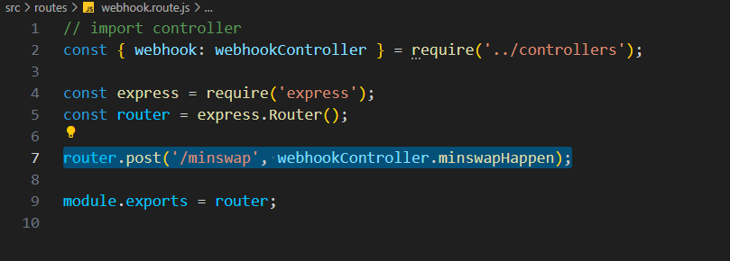
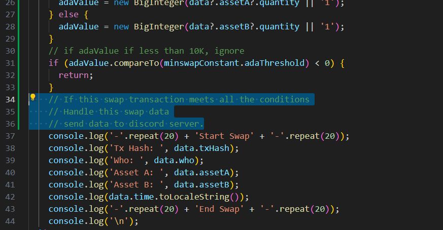
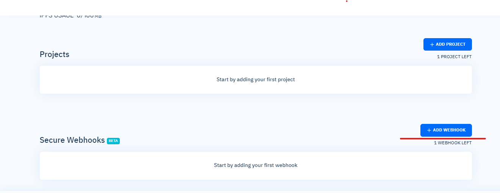

# Cardano-Whale-Bot

## About this project.

This project will get the cardano whales list.
Who owns more than 10K Ada. (from minswap)
And their transaction informations.

This project will monitor the real-time Minswap transactions.

Whenever a new Minswap transaction happens, Minswap webhook in this project will be invoked.

**src/routes/webhook.route.js**


And you can add the custom actions, when Minswap Transaction happens.
You can update the code in Minswap controller.

**src/controllers/webhook.controller.js**


## How to run this project?

In the root directory, run these command

```bash
npm install
npm start
```

## How to link Blockfrost webhook to this project's Minswap hook?

1. Set up the BlockFrost account.

   [Blockfrost](https://blockfrost.io/)

2. Then create a new Webhook.



3. Fill the New Web hook form.

- **Webhook name**: The Name you want.

- **Endpoint URL**: The backend URL.

  - You have to deploy this backend service first.
    (To Digital Ocean, or AWS, ...)

  - And get that backend URL

    (For example: **https://cardano-whale-bot-backend.com/**)

  - And fill that Endpoint URL input with this value.

    (**https://cardano-whale-bot-backend.com/api/webhooks/minswap**)

- **Trigger**: Transaction (Use Default)

- **Required confirmations**: 3 (You can set this reasonably.)

- **Trigger conditions**

  **_We have to add 4 conditions._**

### Minswap Pool Contract Address

```bash
addr1z8snz7c4974vzdpxu65ruphl3zjdvtxw8strf2c2tmqnxz2j2c79gy9l76sdg0xwhd7r0c0kna0tycz4y5s6mlenh8pq0xmsha
```

### Minswap Order Contract Address

```bash
addr1zxn9efv2f6w82hagxqtn62ju4m293tqvw0uhmdl64ch8uw6j2c79gy9l76sdg0xwhd7r0c0kna0tycz4y5s6mlenh8pq6s3z70
```

|  No |     What      |                 Compare |                                            Value |
| --: | :-----------: | ----------------------: | -----------------------------------------------: |
|  1. |  **sender**   |              _equal to_ |   [Pool Address](#minswap-pool-contract-address) |
|  2. |  **sender**   |              _equal to_ | [Order Address](#minswap-order-contract-address) |
|  3. | **recipient** |              _equal to_ |   [Pool Address](#minswap-pool-contract-address) |
|  4. | **quantity**  | _greater than or equal_ |                            10000000000 (10K Ada) |
